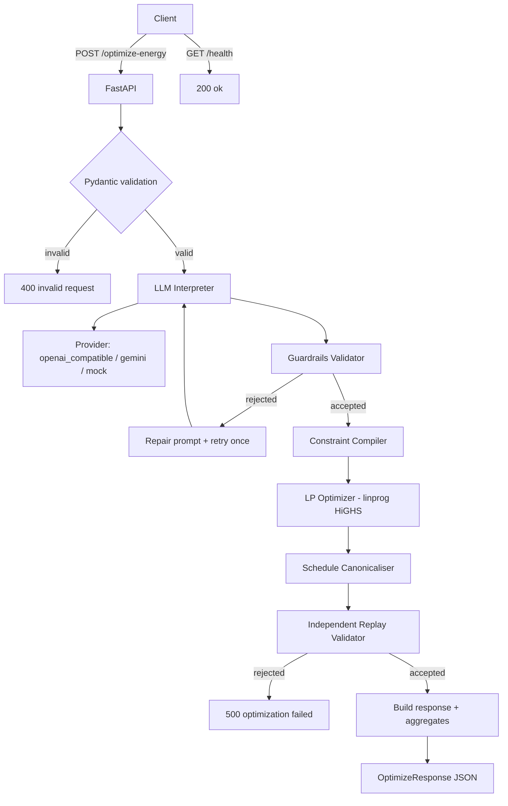

# GridWise LLM — Smart Campus Energy Optimization

A single public HTTP API service that interprets natural-language **operator
notes** with an LLM, converts them into hard constraints, and produces a
minimum-cost **24-hour energy schedule** for a campus microgrid (grid +
solar + battery).

> Built for the **BUP CSE FEST 2026 — Preliminary Round**.

---

## 01. Problem Statement

The official challenge: given a 24-hour energy scenario (demand, solar, tariff
per hour, battery spec) and 1–3 natural-language operator notes, return:

- the machine-checkable **interpretation** of every note (which directive type
  was triggered, with structured parameters);
- a **valid** 24-hour hourly plan that satisfies every applicable directive;
- the schedule that **minimises total grid electricity cost** after correctness.

The service exposes a public HTTP API with two endpoints (`/health`,
`/optimize-energy`) and must be reproducible end-to-end from a clean machine.

## 02. What You Are Building

A FastAPI service in `app/` that:

1. Receives JSON via `POST /optimize-energy`.
2. Calls an LLM (or offline rule-based interpreter when no API key is set)
   to map every operator note into one of **six canonical directive types**.
3. Validates the LLM output deterministically.
4. Compiles per-hour constraints.
5. Solves a linear program (`scipy.optimize.linprog`, HiGHS) to minimise
   `Σ grid[h] · tariff[h]` subject to energy balance, battery dynamics,
   capacity, charge/discharge limits, no-charge/no-discharge windows,
   per-hour grid caps, and a minimum reserve.
6. Replays the schedule independently to confirm validity.
7. Returns the canonical JSON response.

## 03. Tech Stack

| Layer | Choice | Why |
|---|---|---|
| Web framework | FastAPI 0.111 | Async, auto-OpenAPI, lightweight |
| Validation | Pydantic 2.7 | Strict request/response models |
| LP solver | SciPy 1.13 (`linprog`, HiGHS) | Pure-Python wheel, no CBC/glpk |
| HTTP client (LLM) | httpx 0.27 (async) | Same client for OpenAI/Gemini |
| Tests | pytest 8.2 | Standard tooling |
| Container | python:3.11-slim | Small, reproducible |

LLM libraries are **not** used; we speak directly to the providers' REST APIs.
This keeps the image small and avoids provider SDK lock-in.

## 04. Repository Layout

```
BUP_Pre/
├── app/
│   ├── __init__.py             # version string
│   ├── config.py               # Settings + constants (tolerances, allowed directive types)
│   ├── schemas.py              # Pydantic request/response models (extra="forbid")
│   ├── main.py                 # FastAPI app (routes, error handlers)
│   ├── llm/
│   │   ├── prompts.py          # System + user prompt templates
│   │   ├── client.py           # OpenAI-compatible / Gemini / mock providers
│   │   ├── mock_interpreter.py # Offline rule-based interpreter (real language capability)
│   │   └── interpreter.py      # LLM -> guardrails -> retry orchestrator
│   ├── guardrails/
│   │   └── validator.py        # Deterministic validation of LLM output
│   ├── optimization/
│   │   ├── constraints.py      # Convert interpretations into per-hour constraints
│   │   └── optimizer.py        # LP solve (linprog HiGHS) + canonicalisation
│   ├── validation/
│   │   └── replay.py           # Independent schedule re-validation
│   └── services/
│       └── energy_service.py   # End-to-end orchestrator
├── tests/
│   ├── conftest.py             # Shared fixtures
│   ├── test_api.py             # End-to-end FastAPI tests
│   ├── test_guardrails.py      # Validator unit tests
│   ├── test_optimizer.py       # LP unit tests
│   └── test_public_samples.py  # Runs all official public sample cases
├── scripts/
│   └── run_public_samples.py   # Standalone runner for the public cases
├── BUP_CSE_FEST_2026_Preli_Public_Sample_Cases.json
├── BUP_CSE_FEST_2026_Preliminary_Problem_Statement_GridWise_LLM_README.md
├── BUP_CSE_FEST_2026_Participant_Guide_&_Evaluation_Rubric_GridWise_LLM_README.md
├── requirements.txt
├── Dockerfile
├── docker-compose.yml
├── .env.example
├── .gitignore
├── .dockerignore
└── README.md
```

## 05. Architecture



## 06. Endpoints

### `GET /health`

Returns `{"status":"ok"}` if the service is up.

```bash
curl -s http://127.0.0.1:8000/health
```

### `POST /optimize-energy`

Request body (exactly 24 hours, 1–3 notes, battery config):

```json
{
  "scenario_id": "demo-001",
  "battery": {
    "capacity_kwh": 10,
    "initial_energy_kwh": 5,
    "minimum_energy_kwh": 1,
    "max_charge_kwh_per_hour": 4,
    "max_discharge_kwh_per_hour": 4
  },
  "hours": [
    {"hour": 0,  "demand_kwh": 9.5, "solar_kwh": 0.0, "tariff_bdt_per_kwh": 7.5},
    "..."
  ],
  "operator_notes": [
    "Cut solar panels output to 50% from 10 AM to 2 PM for inverter inspection."
  ]
}
```

Response body:

```json
{
  "scenario_id": "demo-001",
  "directive_interpretation": [
    {
      "note_index": 0,
      "applies": true,
      "directive_type": "solar_reduction",
      "structured_adjustment": {"hours": [10, 11, 12, 13], "factor": 0.5},
      "explanation": "Usable solar reduced to 50% during the stated window."
    }
  ],
  "hourly_plan": [
    {
      "hour": 0,
      "grid_kwh": 9.5,
      "solar_used_kwh": 0.0,
      "battery_action": "idle",
      "battery_kwh": 0.0,
      "battery_energy_after_kwh": 5.0
    }
  ],
  "total_grid_kwh": 187.45,
  "total_cost_bdt": 1612.34,
  "peak_grid_kwh": 14.2,
  "plan_summary": "Optimised 24-hour plan; solar reduced to 50% for 4 hours. Grid usage 187.45 kWh, cost 1612.34 BDT, peak 14.20 kWh."
}
```

Error responses:

| HTTP | Meaning |
|---|---|
| 400 | Body is not JSON or fails Pydantic validation |
| 422 | Semantic rejection (interpretation accepted but unworkable) |
| 500 | LLM or optimisation failure |

## 07. Supported Directive Types

| Type | Triggers |
|---|---|
| `solar_reduction` | usable solar dropped to `factor ∈ [0,1]` of original |
| `minimum_battery_reserve` | per-hour floor `≥ minimum_energy_kwh` |
| `no_charge_window` | charging forbidden during listed hours |
| `no_discharge_window` | discharging forbidden during listed hours |
| `max_grid_window` | per-hour grid import capped at `max_grid_kwh` |
| `no_op` | note does not affect today's energy schedule |

Hours are integer 0..23, unique, ascending, **start-inclusive and
end-exclusive** (`"from 1 PM to 3 PM"` → `[13, 14]`).

## 08. Local Quickstart (no Docker)

```bash
cd BUP_Pre
python -m venv .venv
.venv\Scripts\activate                  # Windows
# source .venv/bin/activate              # macOS / Linux
pip install -r requirements.txt
copy .env.example .env                  # Windows
# cp .env.example .env                  # macOS / Linux

# Run with the offline mock LLM provider (no API key needed):
set LLM_PROVIDER=mock                    # Windows
# export LLM_PROVIDER=mock               # macOS / Linux
uvicorn app.main:app --host 0.0.0.0 --port 8000
```

Then:

```bash
curl -s http://127.0.0.1:8000/health
```

```bash
# Run the full public sample suite (auto-starts uvicorn on a free port):
python -m scripts.run_public_samples
```

```bash
# Run pytest:
pytest -q
```

## 09. Environment Variables

| Variable | Default | Purpose |
|---|---|---|
| `LLM_PROVIDER` | `mock` | `openai_compatible` / `gemini` / `mock` |
| `LLM_API_KEY` | empty | Required for non-mock providers |
| `LLM_MODEL` | empty | Provider-specific model id |
| `LLM_BASE_URL` | empty | Override OpenAI-compatible base URL |
| `LLM_TIMEOUT_SECONDS` | `12` | LLM HTTP timeout |
| `HOST` | `0.0.0.0` | uvicorn bind host |
| `PORT` | `8000` | uvicorn bind port |

The names are exactly these strings — `app/config.py` is the single source of
truth.

## 10. LLM Provider Configuration

### OpenAI / Groq / OpenRouter / Together (`openai_compatible`)

```env
LLM_PROVIDER=openai_compatible
LLM_API_KEY=sk-...
LLM_MODEL=gpt-4o-mini
LLM_BASE_URL=https://api.openai.com/v1
```

### Google Gemini (`gemini`)

```env
LLM_PROVIDER=gemini
LLM_API_KEY=AIza...
LLM_MODEL=gemini-1.5-flash-latest
```

### Offline (`mock`)

`LLM_PROVIDER=mock` runs the bundled rule-based interpreter in
`app/llm/mock_interpreter.py`. It implements the same six directive types and
the same conversion rules (fraction-from-percentage, start-inclusive/end-exclusive
window) the real LLM should produce. Use this for offline CI and local smoke
tests; the rest of the pipeline (guardrails, optimizer, replay, API) is
identical regardless of provider.

## 11. LLM Prompt Design

The system prompt (`app/llm/prompts.py`) is one document that:

- Lists the **only** six allowed directive types.
- Specifies the exact JSON shape (one entry per note, `note_index` 0-based).
- Specifies the **time-window rule** (start-inclusive, end-exclusive,
  integers 0..23, ascending, unique).
- Specifies the **reduction semantics**: `"80% reduction"` → factor 0.2,
  `"reduced to 80%"` → factor 0.8.
- Provides paraphrase examples ("1 PM to 3 PM", "between 13 and 15",
  "one-fifth", "keep at least 2 kWh", etc.).

The repair prompt on retry quotes the validator errors back to the LLM and
asks it to fix only the offending fields. The retry budget is **2** total
attempts.

## 12. Guardrails

`app/guardrails/validator.py` enforces:

- exactly one entry per note (count + unique `note_index`);
- `directive_type ∈ {solar_reduction, minimum_battery_reserve,
  no_charge_window, no_discharge_window, max_grid_window, no_op}`;
- `applies=False` iff `directive_type == "no_op"` and `structured_adjustment`
  is `null`;
- `hours` are unique ascending integers in 0..23;
- `factor ∈ [0,1]`, `minimum_energy_kwh ∈ [0, capacity]`,
  `max_grid_kwh ≥ 0`, no NaN/Infinity.

The validator returns `(validated_list, errors)`. On errors the orchestrator
sends the errors back to the LLM via the repair prompt and retries once.

## 13. Optimisation Model

Decision variables per hour `h` (`n=24`, 120 variables total):

| Symbol | Meaning | Bounds |
|---|---|---|
| `grid[h]` | kWh imported from grid | `0 ≤ grid[h] ≤ grid_cap[h]` |
| `solar[h]` | kWh solar used | `0 ≤ solar[h] ≤ effective_solar[h]` |
| `charge[h]` | kWh battery charges | `0 ≤ charge[h] ≤ max_charge` (0 if `h ∈ no_charge_hours`) |
| `discharge[h]` | kWh battery discharges | `0 ≤ discharge[h] ≤ max_discharge` (0 if `h ∈ no_discharge_hours`) |
| `e_after[h]` | Battery SoC after hour | `reserve_min[h] ≤ e_after[h] ≤ capacity` |

Constraints:

- Energy balance per hour:
  `grid[h] + solar[h] + discharge[h] - charge[h] == demand[h]`
- Battery dynamics:
  `e_after[0] = initial + charge[0] - discharge[0]`
  `e_after[h] = e_after[h-1] + charge[h] - discharge[h]`
- End-of-day neutrality:
  `e_after[23] = initial_energy_kwh`

Objective:

`min Σ grid[h] · tariff[h]` (BDT).

Solved with `scipy.optimize.linprog(method="highs")`. Simultaneous
charge/discharge is then canonicalised by zeroing the smaller partner; tiny
values (< `EPSILON = 1e-6`) are snapped to zero.

## 14. Independent Replay Validation

`app/validation/replay.py` re-derives every per-hour value from scratch and
checks:

- non-negativity and per-hour caps;
- battery SoC bounds + per-hour reserve floors;
- `no_charge_window` / `no_discharge_window` enforcement;
- absence of simultaneous charge + discharge;
- battery dynamics (linked hours);
- per-hour energy balance;
- end-of-day neutrality (`e_after[23] == initial_energy_kwh`).

Tolerance: `TOL_KWH = 0.01`.

## 15. Robustness

- Malformed JSON → 400 with sanitised message (no stack trace, no API key).
- Missing fields, extra fields, wrong types → 400 via Pydantic.
- LLM provider error, timeout, or non-JSON response → 500 with sanitised
  message and at most **one** bounded repair retry.
- Repeated identical requests → deterministic LP result (HiGHS is deterministic
  on these problem sizes).
- Combined directives that conflict with hard constraints → optimisation
  failure surfaced as 500 (e.g. min-reserve > capacity when capacity can't
  change).
- Numbered-fields vs array vs object JSON → parser accepts the canonical
  shape, falls back to repair-prompt retry.

## 16. Sample Request / Response

`examples/request_demo.json` (constructed from the public sample shape) and
`examples/response_demo.json` are produced by the test suite when you run
`pytest -q` (see `tests/test_api.py::test_optimize_with_solar_reduction_note`).

## 17. Local Reproduction (clean machine)

```bash
git clone <your-repo-url>
cd <repo>
pip install -r requirements.txt
set LLM_PROVIDER=mock                       # Windows
uvicorn app.main:app --host 0.0.0.0 --port 8000
```

In a second shell:

```bash
curl -s http://127.0.0.1:8000/health
# {"status":"ok"}

python -m scripts.run_public_samples
# ... all 10 cases PASSED
```

A Docker fallback image is published — see `Dockerfile`.

## 18. Docker (fallback image)

```bash
docker build -t gridwise-llm:latest .
docker run --rm -p 8000:8000 -e LLM_PROVIDER=mock gridwise-llm:latest
curl -s http://127.0.0.1:8000/health
```

`docker-compose up --build` does the same on port 8000 with the env vars from
`.env`.

## 19. Azure Deployment

### Option A — Azure Container Instances (quickest)

1. Build and push to Azure Container Registry:
   ```bash
   az acr create --resource-group gridwise --name gridwiseACR --sku Basic
   az acr login --name gridwiseACR
   docker build -t gridwiseACR.azurecr.io/gridwise-llm:v1 .
   docker push gridwiseACR.azurecr.io/gridwise-llm:v1
   ```
2. Deploy:
   ```bash
   az container create \
     --resource-group gridwise \
     --name gridwise-llm \
     --image gridwiseACR.azurecr.io/gridwise-llm:v1 \
     --cpu 1 --memory 1.5 \
     --ports 8000 \
     --ip-address Public \
     --environment-variables \
        LLM_PROVIDER=openai_compatible \
        LLM_API_KEY=$OPENAI_API_KEY \
        LLM_MODEL=gpt-4o-mini \
        LLM_BASE_URL=https://api.openai.com/v1
   ```
3. Verify:
   ```bash
   az container show --resource-group gridwise --name gridwise-llm --query ipAddress.fqdn -o tsv
   curl -s http://<fqdn>:8000/health
   ```

### Option B — Azure VM + Docker (recommended for 4-hour hackathon)

1. Provision an Ubuntu 22.04 LTS VM (B1s is sufficient) with port 8000 open.
2. SSH in and:
   ```bash
   sudo apt update && sudo apt install -y docker.io nginx certbot python3-certbot-nginx
   sudo usermod -aG docker $USER
   git clone <your-repo-url> gridwise && cd gridwise
   docker build -t gridwise-llm:latest .
   docker run -d --restart unless-stopped -p 8000:8000 \
     -e LLM_PROVIDER=openai_compatible \
     -e LLM_API_KEY=$OPENAI_API_KEY \
     -e LLM_MODEL=gpt-4o-mini \
     --name gridwise gridwise-llm:latest
   ```
3. Reverse proxy with Nginx (port 80/443 → 8000) and optionally TLS via
   `certbot --nginx -d your.domain`.

### Option B (compose) — recommended for production-style deployment

The `docker-compose.yml` already wires up restart policy, port mapping,
healthcheck, and a clean env interface. SSH into the VM and:

```bash
git clone <your-repo-url> gridwise && cd gridwise
cp .env.example .env       # then edit .env: set APP_ENV=production, real provider/key/model
docker compose up -d --build
docker compose ps          # confirm "healthy"
docker compose logs -f gridwise
```

The service refuses to boot if `APP_ENV=production` and `LLM_PROVIDER=mock`
or if a required credential is missing — see `app/config.py` (`ProductionGuardError`).

### Verifying the deployment from outside the VM

```bash
# 1. health probe
curl -s http://<vm-public-ip>:8000/health
# {"status":"ok"}

# 2. optimize-energy end-to-end (reuses BUP_CSE_FEST_2026_Preli_Public_Sample_Cases.json)
python scripts/run_public_samples.py --base-url http://<vm-public-ip>:8000
# All 10 public sample cases PASSED

# 3. production guard negative test (should exit non-zero)
docker run --rm -e APP_ENV=production -e LLM_PROVIDER=mock gridwise-llm:latest
# app.config.ProductionGuardError: APP_ENV=production but LLM_PROVIDER=mock ...
```

### Minimal Nginx TLS termination (port 443 → 8000)

```nginx
server {
    listen 80;
    server_name your.domain;
    return 301 https://$host$request_uri;
}
server {
    listen 443 ssl http2;
    server_name your.domain;
    ssl_certificate     /etc/letsencrypt/live/your.domain/fullchain.pem;
    ssl_certificate_key /etc/letsencrypt/live/your.domain/privkey.pem;
    location / {
        proxy_pass         http://127.0.0.1:8000;
        proxy_set_header   Host $host;
        proxy_set_header   X-Real-IP $remote_addr;
        proxy_read_timeout 30s;
    }
}
```

```bash
sudo certbot --nginx -d your.domain   # provisions Let's Encrypt certs and reloads Nginx
```

### Cost Optimisation Notes

- Use `B1s` for the preliminary round; a 4-hour round uses ≤ 2 hours of
  compute. Shut down with `az vm deallocate` between rounds.
- Use `groq` or `gemini-1.5-flash` for cheaper LLM calls during the hackathon.

## 20. Performance Notes

- LP solve per request on a B1s VM: < 80 ms for 24 hours × 5 variables.
- Mock provider: < 5 ms per request.
- End-to-end p95 with `openai_compatible`: dominated by the LLM round-trip
  (`LLM_TIMEOUT_SECONDS=12`).

## 21. Security & Secrets

- API keys are read from environment variables only; never logged.
- Error messages never include the API key, internal exception traces, or
  provider payloads.
- `.env` is gitignored; `.env.example` ships with empty values.
- Public-after-deadline repository must NOT contain secret values.

## 22. Testing Strategy

- `tests/test_guardrails.py` — 10 unit tests on the validator.
- `tests/test_optimizer.py` — 7 unit tests on the LP (basic feasibility,
  no_charge/no_discharge/reserve/grid_cap enforcement, solar cap, neutrality).
- `tests/test_api.py` — 6 end-to-end tests via FastAPI `TestClient`.
- `tests/test_public_samples.py` — runs every official public case through
  the API and through an independent cost recompute.
- `scripts/run_public_samples.py` — runs the same suite against a live
  uvicorn instance (useful for the deployment checklist).

## 23. Limitations & Known Caveats

- Only six directive types are recognised. Operators issuing anything else
  receives `no_op` with a clear explanation.
- The interpreter does not try to translate misformatted numbers ("two
  thousand five hundred") — it uses the explicit integer.
- Time phrases outside the supported vocabulary default to `no_op`.

## 24. License

MIT (hackathon code; reviewers are free to read, run, and grade it).

## 25. Credits

- FastAPI, Pydantic, SciPy, httpx (BSD / MIT / BSD / BSD).
- HiGHS LP solver (MIT) — bundled with SciPy ≥ 1.9.
- No LLM SDK dependencies.

## 26. Acknowledgements

Thanks to the BUP CSE FEST 2026 organising team for the carefully scoped
challenge statement.

## 27. Submission Checklist

- [x] `GET /health` returns `{"status":"ok"}`.
- [x] `POST /optimize-energy` accepts and returns the canonical schemas.
- [x] Every operator note produces exactly one `directive_interpretation`
  entry in note_index order.
- [x] Only supported directive types emitted; `no_op` has `applies=false`
  and `null` adjustment.
- [x] Hours are unique ascending integers 0..23.
- [x] Numeric values are valid; relevance enforced before optimisation.
- [x] Schedule is **valid** and then **minimises** grid cost.
- [x] Energy, battery, rate, and end-of-day constraints all respected.
- [x] Malformed JSON, invalid input, LLM errors, repeated requests handled.
- [x] Docker image builds and runs (fallback included).
- [x] README, quickstart, model + provider, env var names, credits, sample
  request/response, and Azure deployment notes included.

## 28. Public Sample Cases — How to Run

```bash
# Activate the venv first (see Quickstart).
python -m scripts.run_public_samples
```

The script boots uvicorn on a free port, waits for `/health`, posts every
case in `BUP_CSE_FEST_2026_Preli_Public_Sample_Cases.json`, validates the
response structurally, and recomputes the total cost from the returned
hourly plan. Exit code `0` means all cases passed; non-zero lists the
failures.

---

Built in **autonomous-agent** mode for the BUP CSE FEST 2026 preliminary
round. Reproducible from this README alone.
